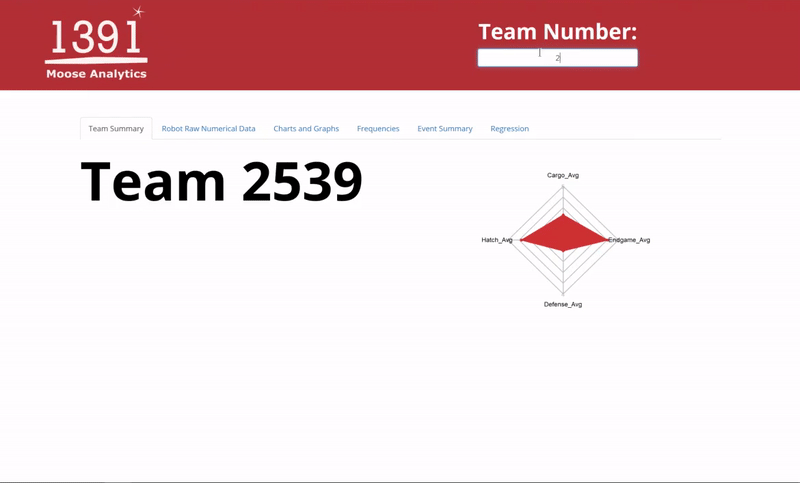

<h1>Moose Analytics v1.0.4 1640 Data-Format Version</h1>
<h4>Graphical Update and Major Launch - 3.6.2019</h4>

A webapp created with R Shiny to show graphs and different data analytic function.
Main app is coded in R in the ui.R file and the server.R files
 
<h4>Website Link:</h4>  
https://mooseanalytics.shinyapps.io/webapp/

<h3>Just Type in the Team Number!</h3> 

 

Includes python script to convert csv headers to something that R can read and interpret.

